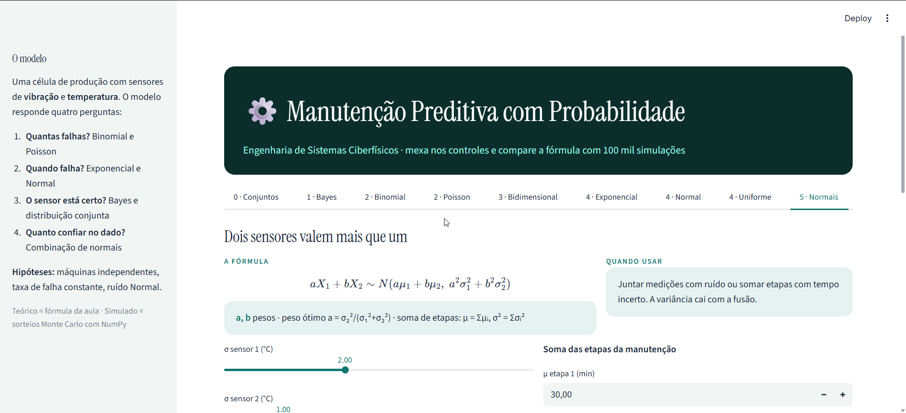
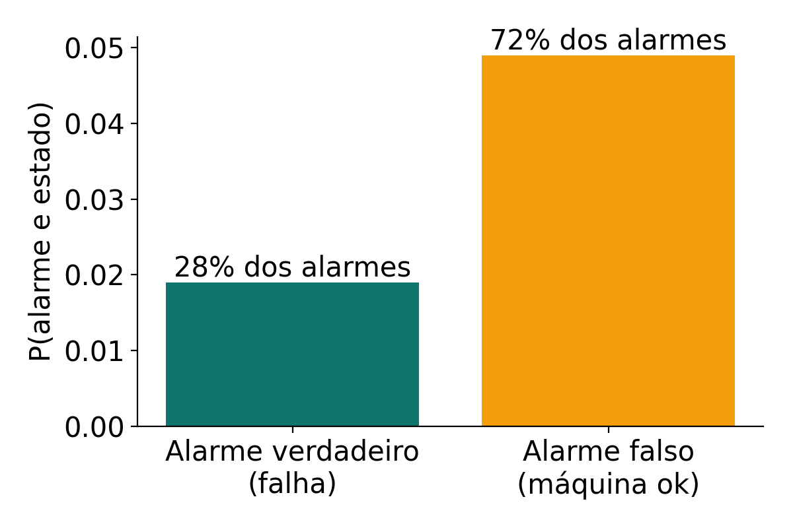
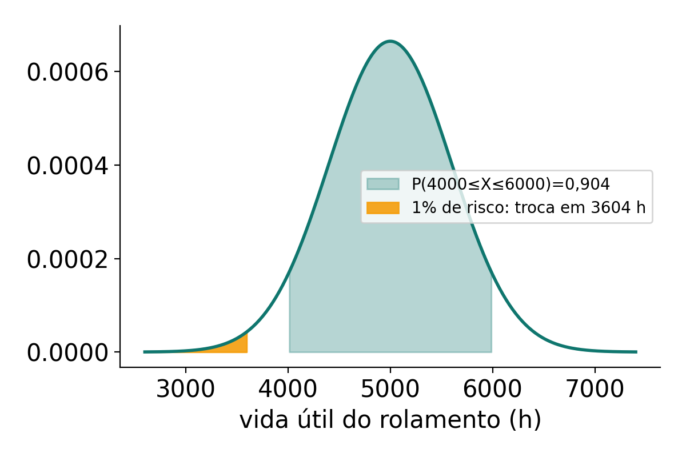

<div align="center">

# Manutenção Preditiva com Probabilidade

**O alarme tocou. É falha mesmo?**

Um painel interativo que aplica probabilidade e estatística a um sistema ciberfísico de
manutenção: sensores de vibração e temperatura, alarmes que erram e a decisão de parar
ou não a máquina.

[](https://www.python.org)
[](https://streamlit.io)
[](https://numpy.org)
[](https://scipy.org)

`Cada fórmula é comparada com 100 mil simulações Monte Carlo`

**Português** &nbsp;·&nbsp; [English](README.en.md)

</div>



---

## O problema

Existem três jeitos de fazer manutenção. A **corretiva** conserta depois que quebra, e a
parada inesperada custa caro. A **preventiva** troca peças por calendário e acaba jogando
fora peça boa. A **preditiva** decide pelo estado real da máquina, medido por sensores.

Só que sensor tem ruído e alarme erra. A pergunta do projeto é:

> Com dados de sensores imperfeitos, como estimar a chance de falha e o melhor momento de intervir?

## O modelo

```
Máquina  →  Sensores (vibração, temperatura)  →  Rede IoT  →  Modelo probabilístico  →  Decisão
```

O modelo responde quatro perguntas, cada uma com uma parte da matéria:

| Pergunta | Distribuição | Para quê |
|---|---|---|
| Quantas falhas? | Binomial, Poisson | Planejar equipe e estoque de peças |
| Quando falha? | Exponencial, Normal | Definir a hora da troca |
| O sensor está certo? | Bayes, distribuição conjunta | Filtrar alarme falso |
| Quanto confiar no dado? | Combinação de normais | Reduzir o ruído da medição |

**Hipóteses:** as máquinas falham de forma independente, a taxa de falhas é constante no
período e o ruído dos sensores é Normal com média zero. Os parâmetros são ilustrativos;
numa fábrica real viriam do histórico da linha.

## O que cada aba mostra

| Aba | Fórmula | Resultado com os valores padrão |
|---|---|---|
| Conjuntos | P(E ∪ M) = P(E) + P(M) − P(E ∩ M) | 17% de chance de falha elétrica ou mecânica |
| Bayes | P(F\|A) = P(A\|F)·P(F) / P(A) | só **28%** dos alarmes são falha real |
| Binomial | C(n,k)·pᵏ·(1−p)ⁿ⁻ᵏ | 26% de ter 2 ou mais máquinas paradas entre 20 |
| Poisson | e^(−λ)·λᵏ / k! | 8% de um mês com 6 falhas ou mais |
| Bidimensional | P(x) = Σ P(x,y), Cov = E[XY] − E[X]E[Y] | vibração alta leva a temperatura alta em 60% dos casos |
| Exponencial | P(T ≤ t) = 1 − e^(−λt) | 39% de falhar nas próximas 500 h |
| Normal | Z = (X − μ)/σ | troca preventiva em 3604 h com 1% de risco |
| Uniforme | (d − c)/(b − a) | 25% das paradas duram entre 20 e 35 min |
| Combinação de normais | aX₁ + bX₂ ~ N(aμ₁ + bμ₂, a²σ₁² + b²σ₂²) | dois sensores juntos erram só 0,89 °C |

Em cada aba o painel mostra a fórmula, o que cada símbolo significa, quando usar,
controles para mudar os parâmetros e o resultado teórico ao lado do simulado.

<p align="center">
  
  
</p>

## Como rodar

```bash
git clone https://github.com/caiogadotti/manutencao-preditiva-probabilidade.git
cd manutencao-preditiva-probabilidade
pip install -r requirements.txt
streamlit run app.py
```

### Publicar no Streamlit Community Cloud

1. Entre em [share.streamlit.io](https://share.streamlit.io) com a conta do GitHub.
2. Clique em **Create app** e escolha este repositório, branch `main`, arquivo `app.py`.
3. Clique em **Deploy**. O tema claro vem de `.streamlit/config.toml`.

## Estrutura

```
app.py                  painel Streamlit (uma aba por assunto)
modelos.py              fórmulas (SciPy) e simulações Monte Carlo (NumPy)
.streamlit/config.toml  tema visual
docs/                   imagens do README
```

## Referências

- LEE, J.; BAGHERI, B.; KAO, H.-A. A Cyber-Physical Systems architecture for Industry 4.0-based manufacturing systems. *Manufacturing Letters*, v. 3, p. 18–23, 2015.
- JARDINE, A. K. S.; LIN, D.; BANJEVIC, D. A review on machinery diagnostics and prognostics implementing condition-based maintenance. *Mechanical Systems and Signal Processing*, v. 20, n. 7, p. 1483–1510, 2006.
- LEE, J. et al. Prognostics and health management design for rotary machinery systems. *Mechanical Systems and Signal Processing*, v. 42, p. 314–334, 2014.
- KALMAN, R. E. A new approach to linear filtering and prediction problems. *Journal of Basic Engineering*, v. 82, n. 1, p. 35–45, 1960.
- MONTGOMERY, D. C.; RUNGER, G. C. *Estatística aplicada e probabilidade para engenheiros*. LTC.

---

Projeto da disciplina de Probabilidade e Estatística, curso de Engenharia de Sistemas Ciberfísicos.
